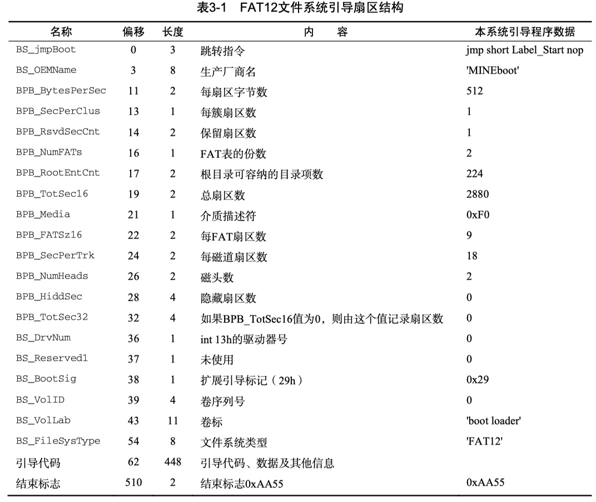
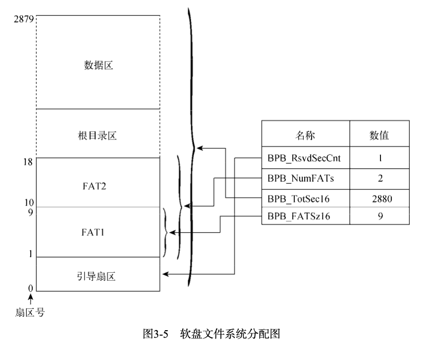
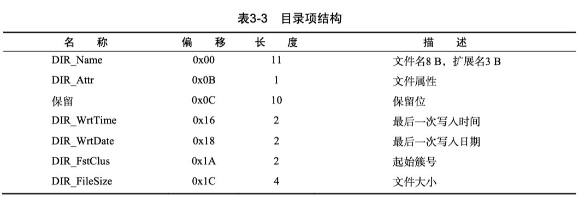

# 第 3 章 BootLoader引导启动程序


## 3.1.5 加载 Loader 到内存



* `File Allocation Table`
* `BS` 前缀是 `Boot Sector` 的缩写，而 `BPB` 则是 `BIOS Parameter Block` 的缩写



* 数据区的簇号与FAT表的表项是一一对应关系

```bash
hdiutil attach ./boot.img
```

**File Allocation Table**

* 对于 FAT12 来说，文件分配表中的每项占用 1.5 字节，也就是 12-bit，这也是 FAT12 这个名字的由来

**Root Directory Area**

* 从第 26 字节开始的两个字节，是一个重要的信息，即文件开始的族号
* 最后的四字节，表示文件的大小

**FAT 格式的二进制分析**

```bash
brew install radare2
```





## Ref

* [FAT文件系统规范v1.03学习笔记---1.保留区之启动扇区与BPB](https://www.cnblogs.com/smartjourneys/p/8413616.html)
* [http://www.cppdll.com/read.php?tid=199&fid=6](http://www.cppdll.com/read.php?tid=199&fid=6)